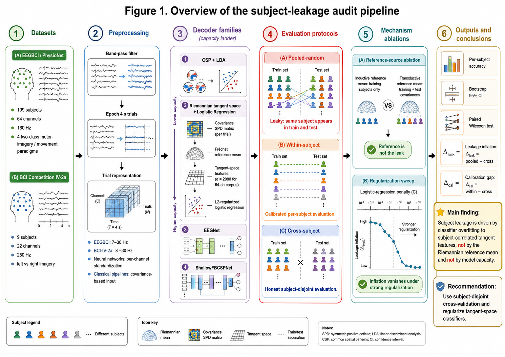

# Subject leakage in EEG decoding is classifier overfitting — not the reference mean, not model capacity



**On executed fists-vs-feet, a 2080-dimensional classical pipeline scores 0.758 and a deep
convolutional network scores 0.755 — the classical method "wins". Split the same trials by
*person* instead of at random and the ordering reverses: 0.662 vs 0.713. Nothing about the
models changed. Only the split did.**

Evaluation code, per-subject result tables and figures for a two-dataset audit (118 subjects)
of what subject leakage in EEG motor-imagery decoding actually *is*. The headline is not that
leaky splits inflate accuracy — that is known. It is that the inflation is
**method-dependent**, so it does not merely raise the scoreboard, it can **reorder** it.

---

## The short version

EEG brain-computer-interface papers train a decoder to tell one imagined movement from
another, and report held-out accuracy. The convenient way to hold data out is to shuffle
everyone's trials together and keep a random fifth. The problem: the same participant then
appears in both train and test, and a classifier can score well by recognising *the person*
rather than *the movement*. Split by participant and the score drops. That much was
understood. Two explanations were on the table; this study falsifies both.

1. **"It's a capacity effect — bigger models memorise subjects."** Refuted. The inflation is
   *non-monotonic* in capacity: the smallest model (CSP + LDA) does not inflate at all, a
   mid-sized one inflates most, and the two largest models are essentially immune.
2. **"It's the Riemannian reference mean."** The worst-affected pipeline projects trial
   covariances into a tangent space around a reference mean estimated on the training set — an
   obvious suspect for information crossing the split. Refuted. Recomputing that reference
   *transductively* (train **and** test) moves accuracy by less than 0.002 on every paradigm.

What is left is ordinary **classifier overfitting to subject-correlated, high-dimensional
features**. At 64 channels the tangent-space representation is 2080 dimensions per trial;
identity is written all over it. A regularization sweep confirms it: the inflation vanishes
under a strong L2 penalty and peaks at a moderate one.

## What we tested and what broke

Three protocols were run over identical epochs, so every comparison is a within-model contrast:

| protocol | how it splits | verdict |
|---|---|---|
| **pooled-random** | `StratifiedKFold(5)`, subject label ignored | leaky — the one under audit |
| **within-subject** | leave-one-run-out, per subject | calibrated, but not a generalisation claim |
| **cross-subject** | `GroupKFold(5)` grouped by subject | honest |

Two quantities are derived per subject, then compared pairwise:
**Δ_leak = acc(pooled) − acc(cross)** (leakage inflation) and
**Δ_cal = acc(within) − acc(cross)** (the calibration gap — how much apparent skill is
subject-specific and does not transfer to a new person).

## Results

### EEGBCI / PhysioNet — 109 subjects, mean per-subject accuracy over 4 paradigms

| decoder | capacity | within | cross | pooled | Δ_cal | Δ_leak | paired Wilcoxon on Δ_leak |
|---|---|---|---|---|---|---|---|
| CSP + LDA | low | 0.676 | 0.576 | 0.562 | +0.100 | **−0.014** | W = 1876.5, *p* = 1.1e−3 (significantly **non-positive**) |
| Riemannian TS + LR | mid (2080-d) | 0.707 | 0.619 | 0.687 | +0.088 | **+0.068** | W = 175.0, *p* = 1.4e−17 |
| ShallowFBCSPNet | high (CNN) | — | 0.709 | 0.721 | — | +0.012 | n.s. |
| EEGNet | high (CNN) | — | 0.755 | 0.756 | — | +0.001 | n.s. |

Two-sided paired Wilcoxon signed-rank, n = 109 subjects; the within-subject protocol was not
run for the deep nets. Read Δ_leak top to bottom: it goes *up*, then back *down*, as capacity
increases. Whatever drives leakage, it is not size. Δ_cal is the more alarming column — worst
case, executed fists-vs-feet with CSP + LDA: **0.761 within-subject, 0.516 across subjects**
against chance 0.502, i.e. 76% held-out-run accuracy collapsing to chance on a new person.

### Replication — BCI Competition IV-2a, 9 subjects, left vs right hand, 2592 trials

| decoder | within | cross | pooled | Δ_cal | Δ_leak |
|---|---|---|---|---|---|
| CSP + LDA | 0.796 | 0.655 | 0.703 | +0.141 | **+0.048** |
| Riemannian TS + LR | 0.829 | 0.645 | 0.746 | +0.184 | **+0.101** |

Chance = 0.500. Note what changed: on 9-subject BCI-IV-2a even CSP + LDA inflates, while on
109-subject EEGBCI it does not. Inflation grows *jointly* with feature dimensionality and with
a *small* subject count — few subjects make subject identity a cheap, high-payoff shortcut.

### The reference mean is not the leak

Switching the tangent-space reference from inductive (train only) to transductive
(train + test), under honest cross-subject CV:

| dataset | mean Δ accuracy | detail |
|---|---|---|
| EEGBCI (109) | **−0.0005** | per-paradigm range −0.0016 … +0.0001 |
| BCI-IV-2a (9) | **+0.0004** | 95% CI [−0.0012, +0.0019] |

The change is below 0.002 on every paradigm. Three of the four EEGBCI paradigm CIs straddle
zero; the fourth (`real_fists_feet`, CI [−0.00307, −0.00022]) excludes zero in the *negative*
direction — transductive is very slightly **worse**. Either way the effect is two orders of
magnitude smaller than the +0.068 inflation it was proposed to explain.

## The mechanism

If leakage is the classifier overfitting subject-correlated features, penalising the classifier
should remove it. It does. Mean Δ_leak over the four EEGBCI paradigms against the
logistic-regression inverse penalty `C` (larger `C` = weaker regularization):

| `C` | 1e−3 | 1e−2 | 1e−1 | 1 | 10 | 100 |
|---|---|---|---|---|---|---|
| mean Δ_leak | **−0.009** | +0.042 | **+0.072** | +0.065 | +0.053 | +0.053 |

Inflation is absent under strong regularization, peaks at moderate penalty, then plateaus. Same
features, same splits, same data — only the penalty moves.

## What this means for benchmarks

Because inflation is method-dependent, a leaderboard run under subject-mixing is not uniformly
optimistic; it is *differentially* optimistic, and it can invert conclusions. On executed
fists-vs-feet:

- pooled-random: Riemannian TS + LR **0.758** > ShallowFBCSPNet **0.755**
- cross-subject: Riemannian TS + LR **0.662** < ShallowFBCSPNet **0.713**

The leaky protocol ranks a classical feature pipeline above a deep network; the honest one
reverses it by five accuracy points. Averaged over all four paradigms, mixing subjects shrinks
the deep net's margin over the Riemannian pipeline from 0.090 to 0.034 — the opposite of the
usual intuition that deep networks are the ones at risk of overfitting. Evaluated correctly the
ordering is unambiguous: EEGNet **0.755**, ShallowFBCSPNet **0.709**, Riemannian TS + LR
**0.619**, CSP + LDA **0.576** cross-subject.

**Recommendation:** split by subject (`GroupKFold` / `LeaveOneGroupOut`), regularize
tangent-space classifiers, and report the within-vs-cross calibration gap next to the headline
accuracy.

## Datasets

Both are fully public with no EULA, and are fetched by the preparation scripts.

| dataset | subj | ch | rate | task | loader |
|---|---|---|---|---|---|
| PhysioNet EEG Motor Movement/Imagery | 109 | 64 | 160 Hz | 4 two-class paradigms (imagined/executed; left-vs-right fist, fists-vs-feet) | `mne.datasets.eegbci` |
| BCI Competition IV-2a (BNCI2014-001) | 9 | 22 | 250 Hz | left vs right hand imagery | MOABB |

EEGBCI: 7–30 Hz zero-phase FIR, 0–4 s epochs, no trial rejection. BCI-IV-2a: 8–30 Hz.
Riemannian pipeline = `pyriemann` `Covariances(oas)` → `TangentSpace(riemann)` →
`LogisticRegression(C=1.0)`. Deep nets = `braindecode` `EEGNetv4` / `ShallowFBCSPNet`, Adam
lr 1e−3, batch 64, 40 epochs, early stopping. Statistics: per-subject accuracy → 2000-fold
subject-level bootstrap 95% CI plus two-sided paired Wilcoxon; an effect is claimed **only**
when the paired test is significant *and* the bootstrap CI excludes zero.

## Repository structure

```
result/figure/exp0_overview_fig1.png   # the 6-panel pipeline schematic above
result/figure/exp1|exp2|exp3/          # protocol, capacity-ladder and mechanism figures
results/eegbci_full/, results/bci2a/   # every result table (CSV), per subject
test/experiments/eegbci_full/
  eegbci_full_dataset_prepare.py         # download + epoch all 109 subjects -> npz cache
  eegbci_full_leakage_experiment.py      # 3 protocols x CSP+LDA / Riemannian
  eegbci_full_deep_baselines.py          # EEGNet / ShallowFBCSPNet rungs
  eegbci_reference_leakage_ablation.py   # hypothesis 2: inductive vs transductive reference
  eegbci_classifier_mechanism.py         # L2 regularization sweep
  eegbci_paired_stats.py                 # bootstrap CIs + paired Wilcoxon
  eegbci_full_make_figures.py, make_mechanism_figures.py
test/experiments/bci2a/                # BCI-IV-2a replication (prepare + replication)
```

To reproduce: `pip install numpy scipy scikit-learn mne braindecode pyriemann moabb
matplotlib`, then run the scripts above in listed order (`*_dataset_prepare.py` first — it
downloads the corpora). Everything ran on CPU. Raw EEG is not redistributed here; the prepare
scripts fetch both corpora from their official sources.

## Limitations

Stated candidly, because several of them bound the claims above.

- **Two public corpora, two-class motor imagery only** — no claim about multi-class paradigms,
  other EEG tasks, or clinical recordings.
- **The deep-net rung is missing on the second dataset** (a `moabb`/`braindecode` version
  incompatibility), so the capacity result rests on **one** dataset.
- **"Inflation grows with feature dimensionality"** is inferred from a two-dataset, two-method
  contrast, not from a controlled dimensionality sweep.
- **Deep nets were trained without extensive hyperparameter search**, so their absolute
  accuracies are conservative. The claims concern *inflation*, a within-model contrast, which is
  why this does not undermine them — but these are not state-of-the-art figures.
- **The mechanism is characterized empirically**, via the regularization sweep, not with a
  formal generalization bound. **Single seed per configuration**: uncertainty comes from the
  subject-level bootstrap and the paired tests across subjects, not from seed repetitions.
- **The paper prescribes rather than provides a fix.** "Regularize and use subject-disjoint CV"
  is a discipline, not a method. We consider this the study's main weakness.

## Status

Manuscript — *Subject leakage in EEG motor-imagery decoding is classifier overfitting, not a
reference-mean or model-capacity effect: a two-dataset audit* (W. Jeong, H. Oh, Sungkyunkwan
University) — submitted to the **Journal of Neural Engineering** (IOP); results frozen
2026-07-10, awaiting review. The manuscript is kept private until acceptance; the code,
per-subject result tables and figures behind every number above are here.

## Author and license

Woncheol Jeong — MIT licensed, see [LICENSE](LICENSE). The EEG corpora are third-party public
datasets, obtained from their original distributors and not redistributed here.
