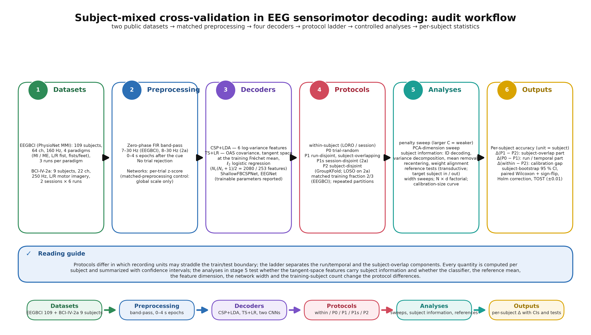

# Subject overlap in subject-mixed cross-validation of EEG sensorimotor decoders



A hierarchical split audit of subject-mixed cross-validation on two public EEG sensorimotor datasets
(PhysioNet motor movement/imagery, 109 subjects; BCI Competition IV-2a, 9 subjects) with four decoders
(CSP+LDA, Riemannian tangent space + logistic regression, ShallowFBCSPNet, EEGNet). The splits differ in which
recording units may straddle the train/test boundary — trial-random (P0), run-disjoint but subject-overlapping
(P1), session-disjoint (P1s, IV-2a) and subject-disjoint (P2; leave-one-subject-out on IV-2a) — at matched
training fractions with repeated partitions, so that the **subject-overlap component** Δ(P1 − P2) can be separated
from the **run/temporal component** Δ(P0 − P1). Controlled analyses of the tangent-space pipeline ask where the
subject information lives.

This release (`revision-v2`) supersedes the July 2026 analysis (kept under `test/experiments/eegbci_full`,
`test/experiments/bci2a`, `results/eegbci_full`, `results/bci2a`). Two July statements are withdrawn by the new
controls: regularization does **not** remove the subject-overlap component (it shrinks only with underfitting),
and the convolutional networks are **not** unaffected (they show a component of about 0.02 on EEGBCI and
0.06–0.09 on IV-2a).

## Plain-language summary

If trials of the same person are on both sides of a cross-validation split, a decoder can look better than it
will be on a new person. We measured how much of that inflation is really due to the person being on both sides,
as opposed to neighbouring trials of the same run or session. On 109 subjects, letting subjects straddle the split
while keeping runs disjoint inflated the tangent-space pipeline by 0.068 accuracy, the two networks by about
0.02 and CSP+LDA by 0.009; run adjacency added nothing. The tangent-space features identify the subject perfectly
(86 % of their variance is between subjects); centring each subject on its own mean removes about 70 % of the
inflation and raises cross-subject accuracy by 0.08. Stronger regularization does not help; subject-disjoint
evaluation remains necessary.

## Key numbers (unit = subject; EEGBCI = mean over four paradigms, n = 109; 95 % subject-bootstrap CIs; source files in `results/revision/`)

| Decoder | P0 trial-random | P1 run-disjoint | P2 subject-disjoint | Δ(P1 − P2) subject overlap | Δ(P0 − P1) run adjacency |
|---|---|---|---|---|---|
| CSP+LDA | 0.554 | 0.579 | 0.570 | +0.009 [+0.003, +0.015] | −0.025 [−0.031, −0.018] |
| TS+LR | 0.685 | 0.688 | 0.620 | +0.068 [+0.058, +0.077] | −0.003 [−0.008, +0.002] |
| ShallowFBCSPNet | 0.710 | 0.710 | 0.688 | +0.022 [+0.017, +0.027] | 0.000 [−0.005, +0.004] |
| EEGNet | 0.754 | 0.750 | 0.726 | +0.024 [+0.018, +0.030] | +0.004 [0.000, +0.008] |

Paired two-sided Wilcoxon signed-rank tests over the 109 subjects, Holm-corrected (`stats_rev1_contrasts.csv`):
subject-overlap components p < 10⁻⁹ for all four decoders (CSP+LDA p_Holm = 0.016).

BCI-IV-2a (n = 9, leave-one-subject-out; `stats_rev1_contrasts.csv`): run-disjoint − LOSO = +0.098 (TS+LR),
+0.051 (CSP+LDA), +0.060 (ShallowFBCSPNet), +0.094 (EEGNet); session-disjoint − LOSO = +0.036 / +0.025 /
+0.021 / +0.059 (exact Wilcoxon floor p = 0.0039 at n = 9).

Other results (all in `results/revision/stats_rev1_*.csv`): regularization sweep (`e2`), subject-identity
decoding and variance decomposition (`e3a`, `e3b`), subject-mean removal and Riemannian recentering (`e3c`),
weight alignment (`e3d`), PCA-dimension sweep (`e4`), six classifiers on identical features (`e5`), reference-mean
tests with TOST (`e6`, `e14`), width sweeps (`e9_*width*`), training-subject count × dimension factorial (`e8`),
within-subject networks (`e11`), calibration-size curve (`e12`: thirty labelled trials raise TS+LR by +0.070, leave CSP+LDA unchanged, and do not improve EEGNet under fixed fine-tuning), matched preprocessing (`e1_*ztrial*`,
`e9_*global*`), exploratory stratification analysis (`e15`).

## Reproduce

```bash
python -m venv .venv && source .venv/bin/activate
pip install numpy scipy scikit-learn mne pyriemann moabb braindecode torch matplotlib joblib
# data (public): EEGBCI 109 subjects via MNE (a PhysioNet S3 mirror is much faster than physionet.org), BCI-IV-2a via MOABB
python test/experiments/eegbci_full/eegbci_full_dataset_prepare.py
python test/experiments/bci2a/bci2a_dataset_prepare.py
# the revision suite (see research/REVISION_PLAN_v1.md for the frozen definitions and decision rules)
bash test/experiments/revision/run_all.sh rev1          # one CPU chain + one chain per GPU; ~3 h on 48 cores + 4 L40S
python test/experiments/revision/e_stats.py --tag rev1 ... # statistics tables (arguments listed in the script header)
python test/experiments/revision/fig2_ladder.py --e1 ... # one script per figure
```

Every run writes a JSON manifest (command, seeds, package versions, code revision, output hashes) next to its
CSVs. Seeds: 20260916 (+0–4 for repeated partitions), 20260916–20260918 for network training.

## Limitations

Two public two-class sensorimotor corpora; one training recipe for the networks; width sweeps and the
calibration curve with one seed; the residual subject-overlap component after subject-mean removal (about 0.02)
is not explained by the diagnostics here; the exploratory stratification analysis was added after the ladder
results were seen.

## Layout

```
test/experiments/revision/   # common.py, deep_common.py, e1..e15 experiment scripts, e_stats.py, make_tables.py, fig*.py, run_all.sh
results/revision/            # per-subject / per-fold / per-draw result tables (tag rev1) + manifests + stats tables
result/figure/revision/      # figures (PNG, 300 dpi) with generated captions
research/REVISION_PLAN_v1.md # frozen analysis plan (sha256 in REVISION_PLAN_v1.sha256)
test/experiments/eegbci_full, test/experiments/bci2a, results/eegbci_full, results/bci2a   # July 2026 analysis (superseded)
```

License: MIT (Copyright (c) 2026 Woncheol Jeong).
